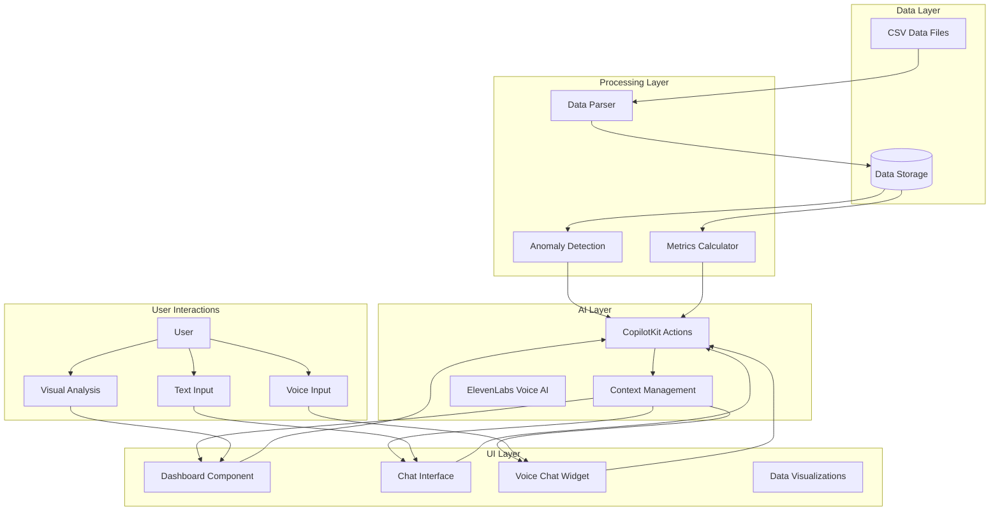
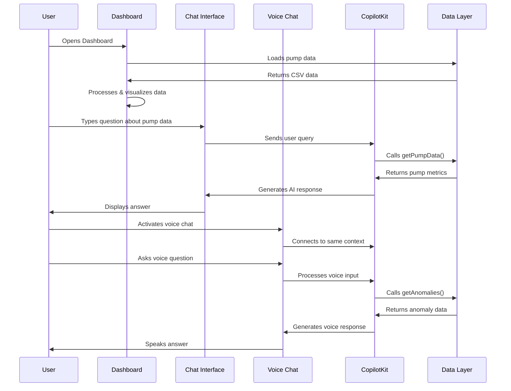
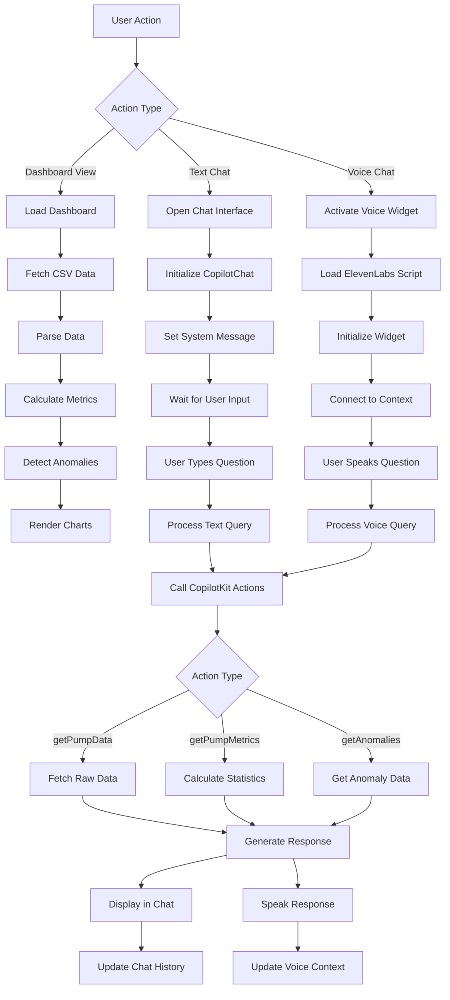
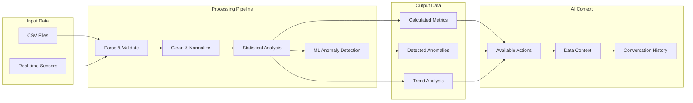
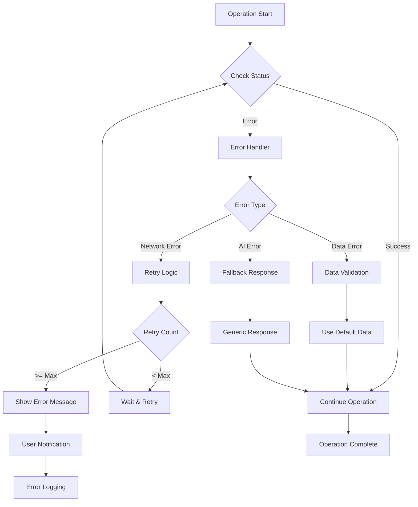
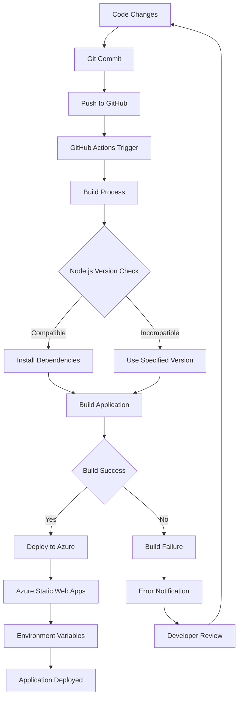

# Application Logical Flow Diagram

## High-Level System Architecture

## Detailed User Interaction Flow

## Component Interaction Flow

## Data Processing Pipeline

## Error Handling and Recovery

## Deployment and CI/CD Flow

This comprehensive flow diagram shows:
1. **Data Flow**: How data moves from CSV files through processing to AI and UI
2. **User Interactions**: Different ways users can interact with the system
3. **Component Architecture**: How different parts of the system communicate
4. **Error Handling**: Robust error handling and recovery mechanisms
5. **Deployment Process**: Complete CI/CD pipeline from code to production
